# Foxy Payment Card Embed + Retool

This is an example of a Custom Component Library for [Retool](https://www.retool.com) containing the Foxy Payment Card Embed. Use this as a base for your own library or an extended Payment Card Embed configuration.

To learn more about how custom component libraries work, visit Retool's [official documentation](https://docs.retool.com/apps/guides/custom/custom-component-libraries).

## Setup

1. Create an API access token with read and write scopes for Custom Component Libraries. See the [Retool API authentication documentation](https://docs.retool.com/org-users/guides/retool-api/authentication#create-an-access-token) for instructions on generating an access token.
2. Install dependencies: `npm install`
3. Log in to Retool: `npx retool-ccl login` (providing your access token from step 1)
4. Start dev mode: `npx retool-ccl dev`

## Usage

### Adding the Payment Card Embed

Open Retool and navigate to your project. Look for Foxy Elements > Payment Card Embed component in the components menu and drag it onto the canvas. You should see the demo state load right away:

[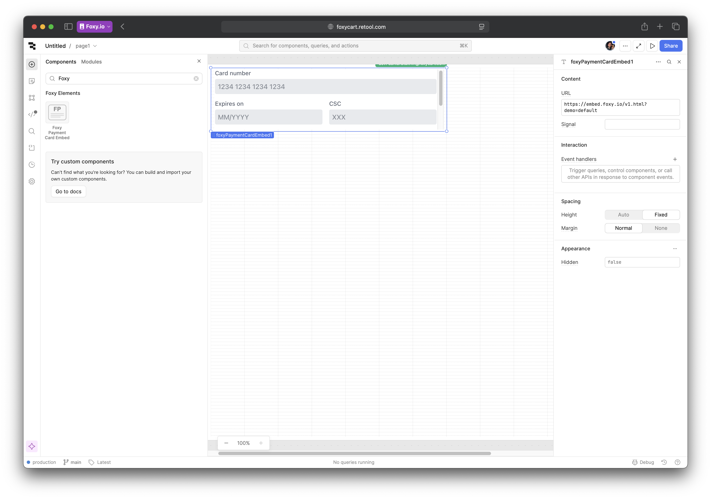](./img/1.png)

To link the payment embed to your store, go to Foxy Admin > Settings > Templates, select the Template Set you'd like to use and find its id.

[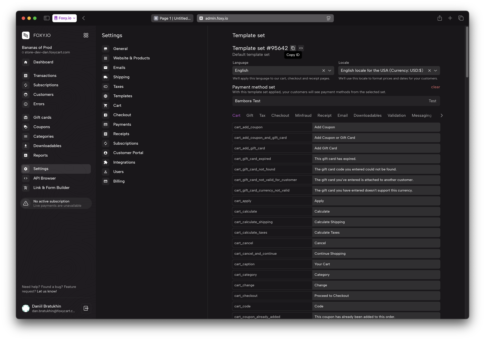](./img/2.png)

Back in the Retool editor, select the Payment Card Embed component and replace the URL with the following: `https://embed.foxy.io/v1.html?template_set_id=` + your template set ID.

[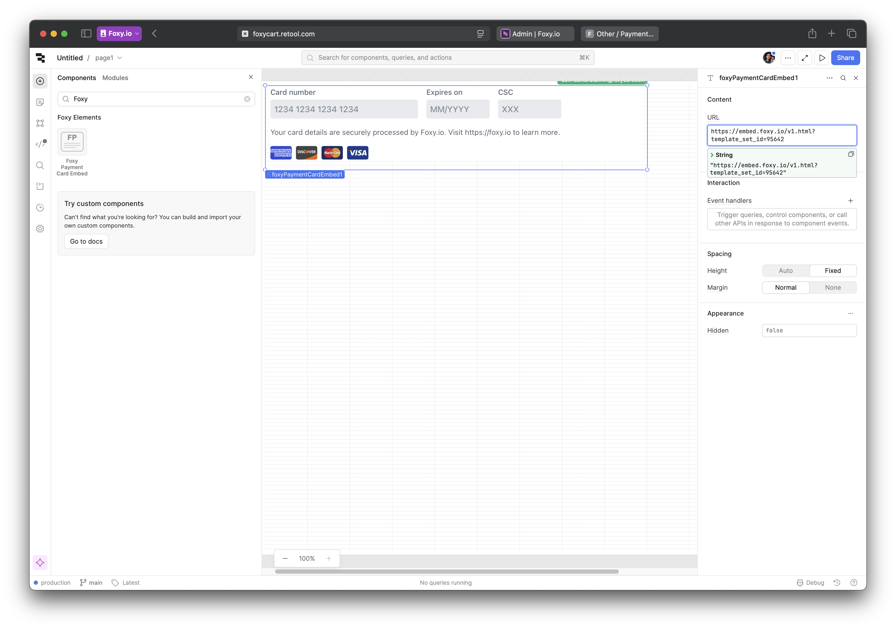](./img/3.png)

The embed will now display the appropriate UI for the payment method set linked to the template set.

### Tokenizing cards

Add a button below the payment card embed. In this example we'll label it "Save card":

[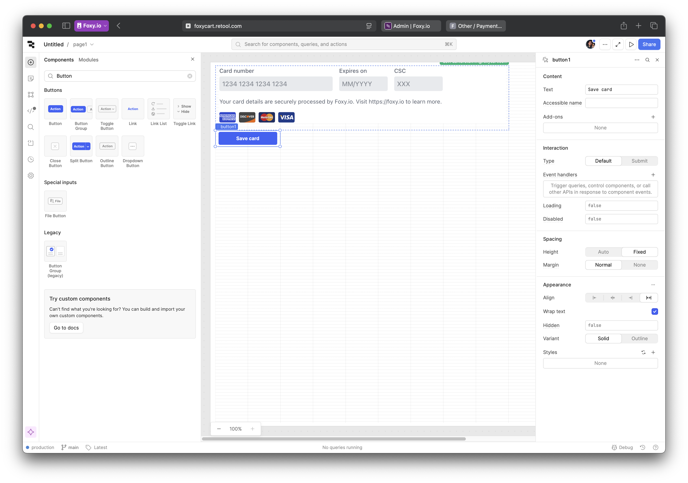](./img/4.png)

Because Retool's component API is limited, we'll need to use a variable to send a signal to the payment card embed. In Retool, select Code in the sidebar, and create a variable scoped to the page payment card embed is on:

[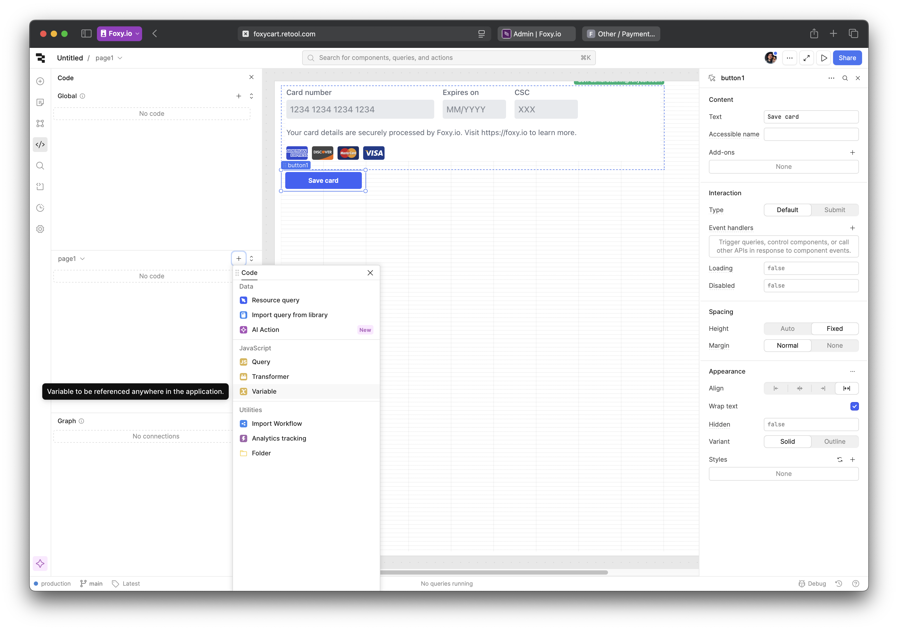](./img/5.png)

Give this new variable an appropriate name and set the inital value to an empty string:

[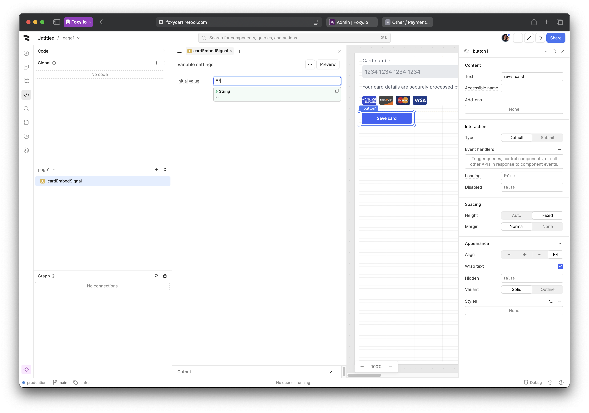](./img/6.png)

Next, link the Signal property in the payment card embed settings to the variable you just created. Remember to use `{{ yourVariable.value }}` syntax to link to the actual value it holds:

[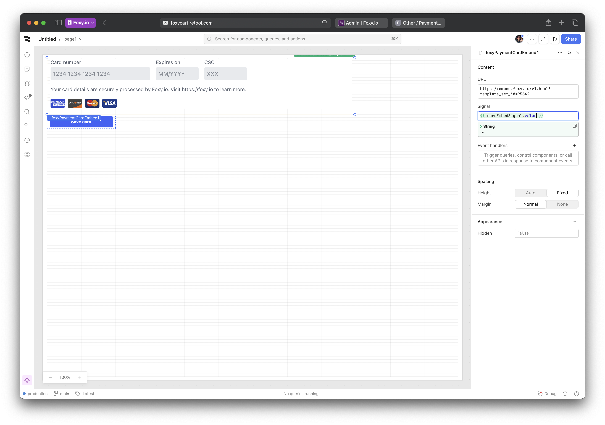](./img/7.png)

Finally, in the button settings, add an event handler for the "Click" event. Select "Set variable" for Action, and choose the variable you created earlier in the State field. Use "Set value" for method, and "tokenize" for value – this is the signal that will trigger the tokenization process in the payment card embed.

[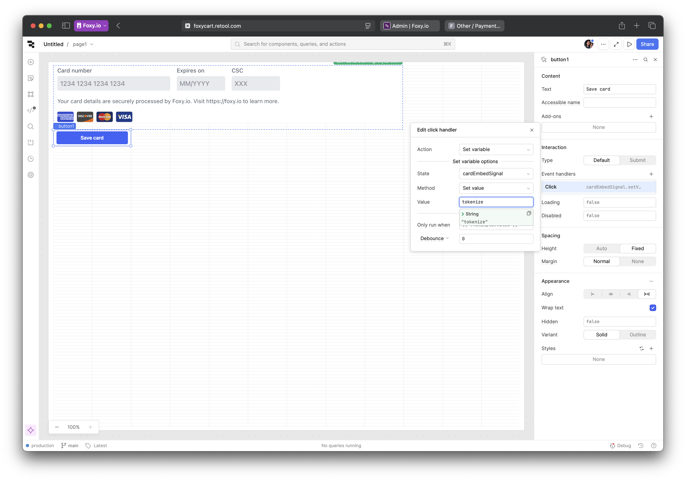](./img/8.png)

To provide a better user experience, you can also add loading states or success messages based on the status of the tokenization process. In this demo, payment card embed exposes the `status` property with values `idle`, `busy`, and `fail`. You can link these states to the button's loading state under Interaction settings like so:

[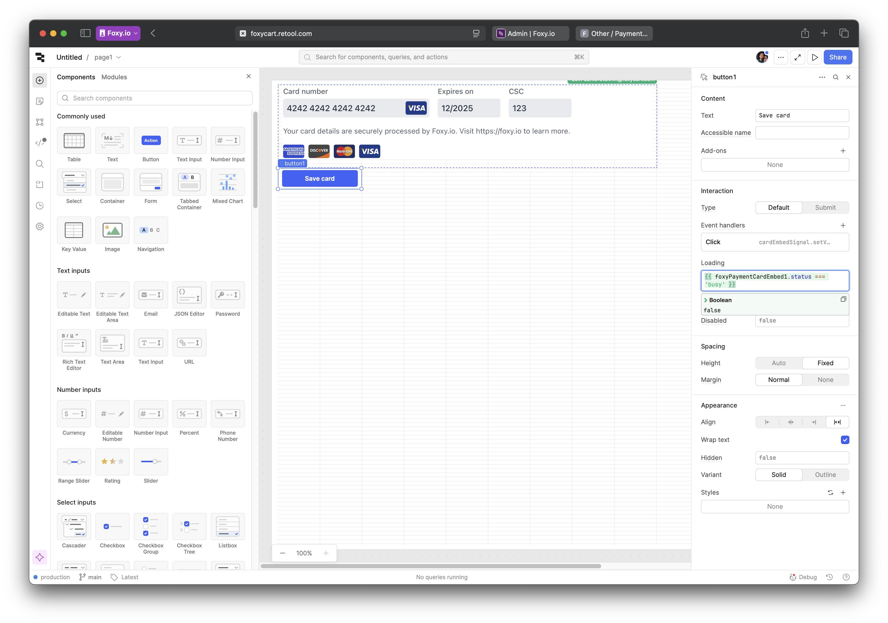](./img/9.png)

Now, try entering test card details (for example, `4242 4242 4242 4242` + any future expiration date and CVC) and clicking the "Save card" button. If everything is set up correctly, you should see the button and payment card embed switch to the loading state momentarily and then revert back to the original state. At that point, the token is already available in the `token` property of the payment card embed. You can see it by selecting State from the left sidebar and then the payment card embed component. Additionally, the `token` event has been emitted by our custom component to signal that the token is ready. From here, we can use this token to update customer's default payment method.

### Using the token to update customer's default payment method

Foxy provides a comprehensive [API](https://api.foxy.io/docs) for managing every aspect of your store, including customer payment methods. This API uses Hypermedia format and OAuth2 for authentication. To get started, you will need a client. To obtain one, make the following request to `https://api.foxy.io/clients` with your project/contact info:

```sh
curl -H "FOXY-API-VERSION: 1" https://api.foxy.io/clients -d "redirect_uri=https://oauth.retool.com/oauth/user/oauthcallback&project_name=YOUR_PROJECT_NAME&company_name=YOUR_COMPANY_NAME&contact_name=YOUR_NAME&contact_email=YOUR_EMAIL&contact_phone=YOUR_PHONE"
```

In response you will receive Client ID, Client Secret and a set of tokens for managing your API client. Save those values as there's no way to recover them if they are lost.

Now let's create a new REST API Resource in Retool with those credentials. Click on the Retool logo in the top left corner, select Resources from the menu, and on the page that opens click on the "Create new" button and select "Resource". Then select REST API as a resource type.

In the form, enter the following details:

- **Name**: Foxy API (or any name you prefer)
- **Base URL**: `https://api.foxy.io`
- **Headers**:
  1. Add a header with the key `Authorization` and the value `Bearer YOUR_ACCESS_TOKEN`
  2. Add a header with the key `FOXY-API-VERSION` and the value `1`
- **Authentication**: select "OAuth 2.0", with "Authorization Code Grant" flow
- **Authorization URL**: `https://auth.foxy.io/authorize`
- **Access Token URL**: `https://api.foxy.io/token`
- **Client ID**: Client ID you've obtained from the API earlier
- **Client Secret**: Client Secret you've obtained from the API earlier
- **Scopes**: `store_full_access`
- **Prompt**: select "No Prompt"

[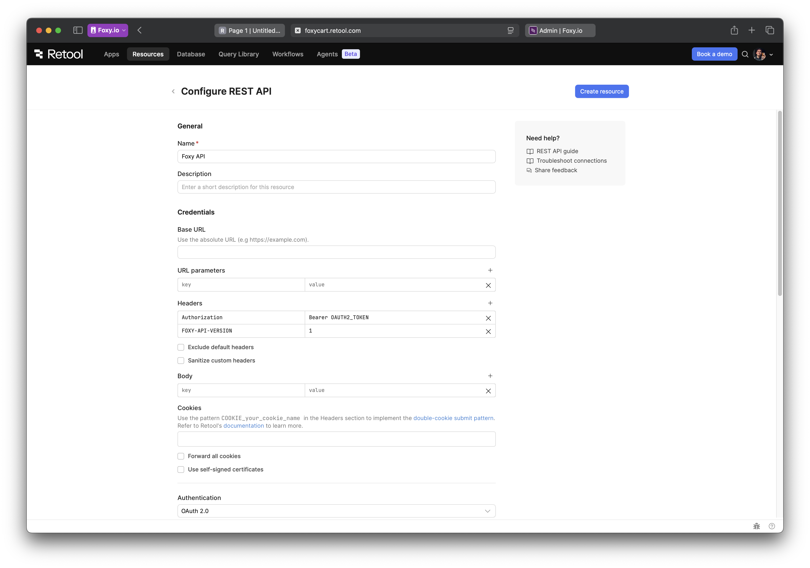](./img/10.png)

Once ready, click "Connect with OAuth" button.

[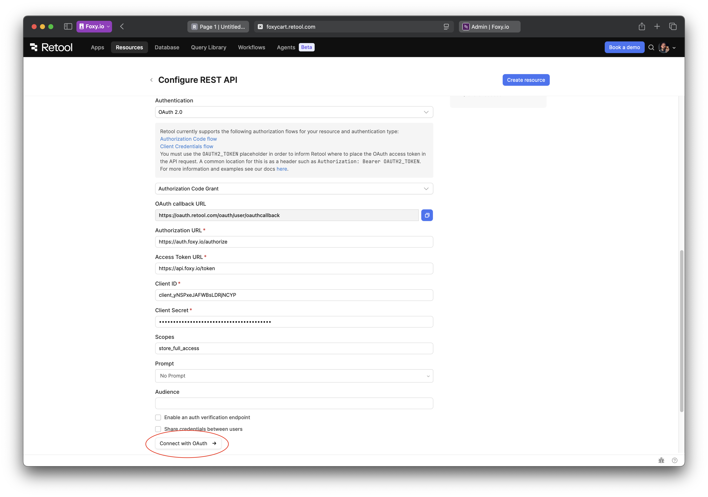](./img/11.png)

If Retool asks to confirm connecting to the Foxy API, click "Authenticate" in the next screen. On the next page, pick the store you'd like to give Retool access to and click Allow.

[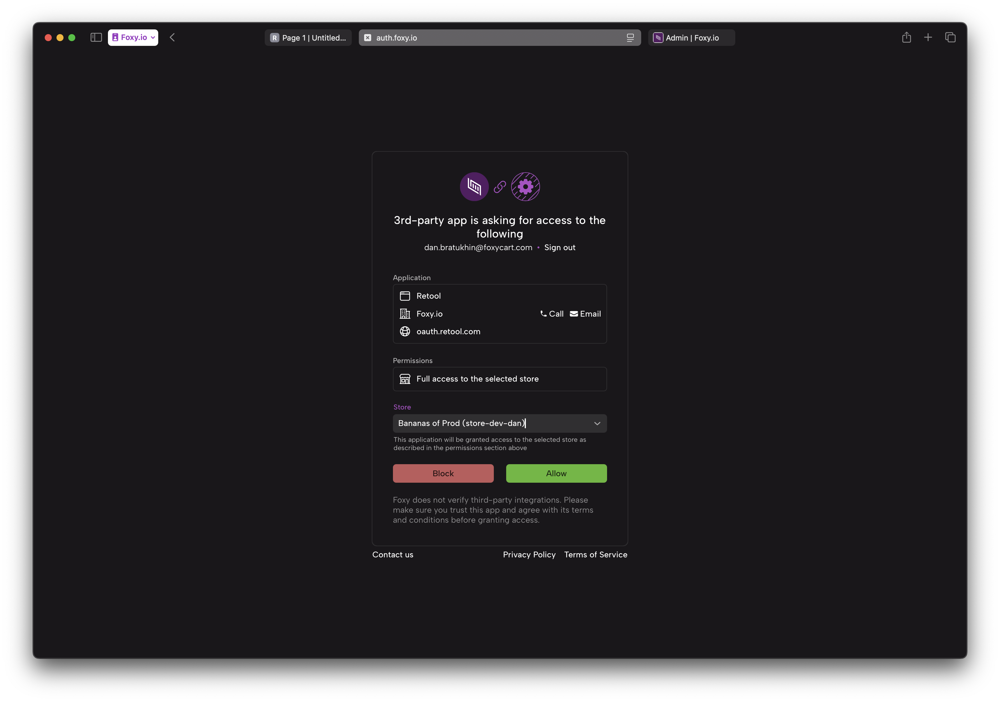](./img/12.png)

Done! If everything went well, you should be redirected back to Retool and see "Connected" at the bottom of the page. Now let's go back to the Retool editor for the final step.

In the Retool editor, select your payment card embed and add an event handler for the `token` event under Interaction settings. Select "Control query" for Action and "Create a new query" for Query.

[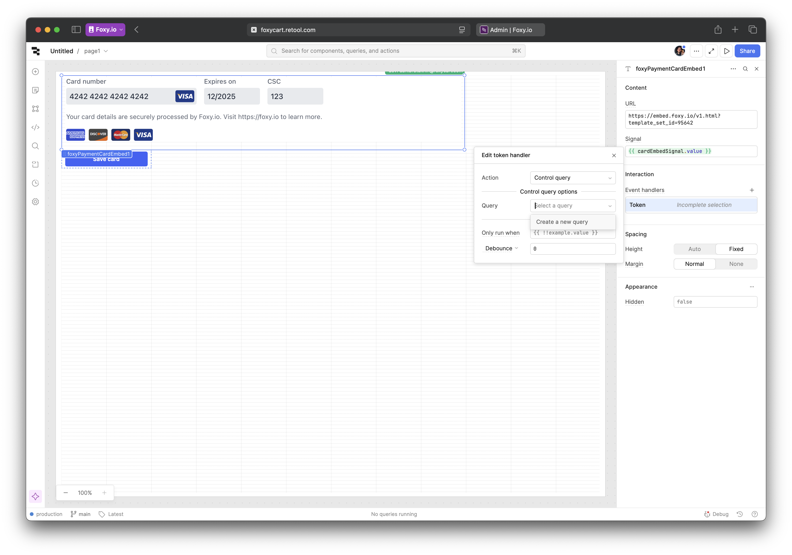](./img/13.png)

In the panel that opens on the left, select Foxy API resource that you've created earlier. To save the new card, we will be using the [default payment method](https://api.foxy.io/rels/default_payment_method) relation from Foxy API with `PATCH` as request method. The URL will look like this:

```
https://api.foxy.io/customers/YOUR-CUSTOMER-ID/default_payment_method
```

You can get the customer ID from the admin dashboard for testing purposes. Later on you will likely be setting this value dynamically via a variable in the local or global state but this is outside of the scope for this guide.

Next, in the JSON body, add a single key `cc_token` with the value from the `token` property of the payment method embed component. For the purposes of this demo, you can also add a simple Success and Failure event handlers – for example, Confetti and Show Notification just to get some visual feedback. Hint: `{{ self.data.data._embedded['fx:errors'][0].message }}` in notification description will display the first API error in case it occurs.

[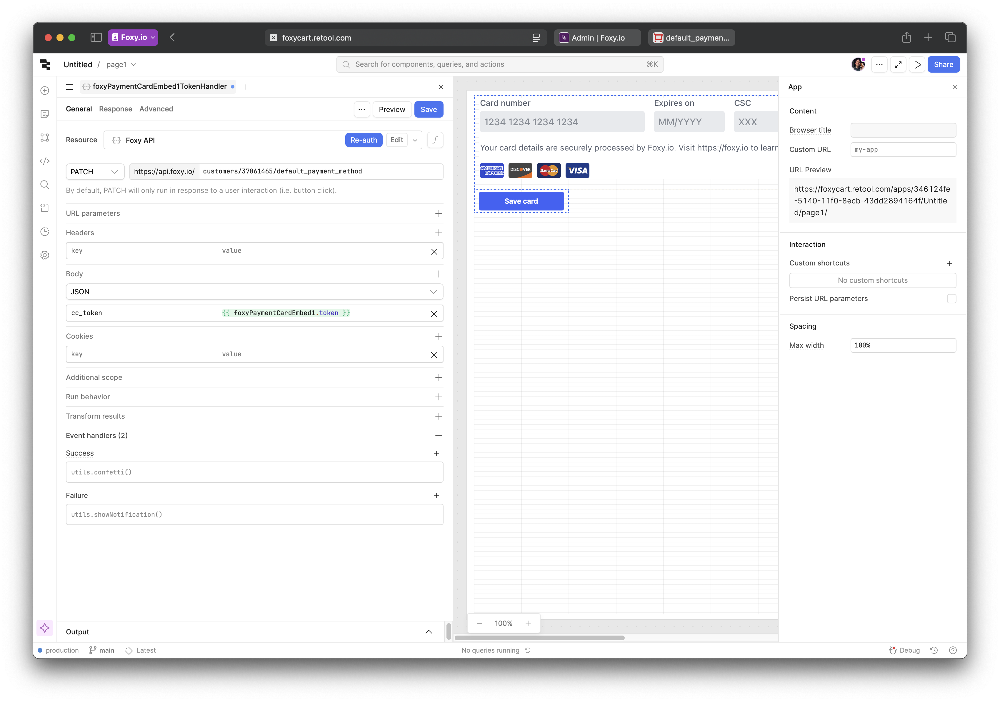](./img/14.png)

Click Save and try it out! If you got confetti, then everything is working as expected. Check the customer page in the admin – it should show the new payment method. If you got an error, please send it to Foxy's support team and we will help you troubleshoot the issue.

## Deploy

When you're done creating your component, deploy it with the following command:

```sh
npx retool-ccl deploy
```

This pushes an immutable version of the component to Retool.

Now your component library is ready for production use. If you want to use your component library in public apps, then you need to go to Settings > Custom Component Libraries and set it to be public as well. Learn more about deploying custom component libraries in [Retool Docs](https://docs.retool.com/apps/guides/custom/custom-component-libraries#9-deploy-your-component).
