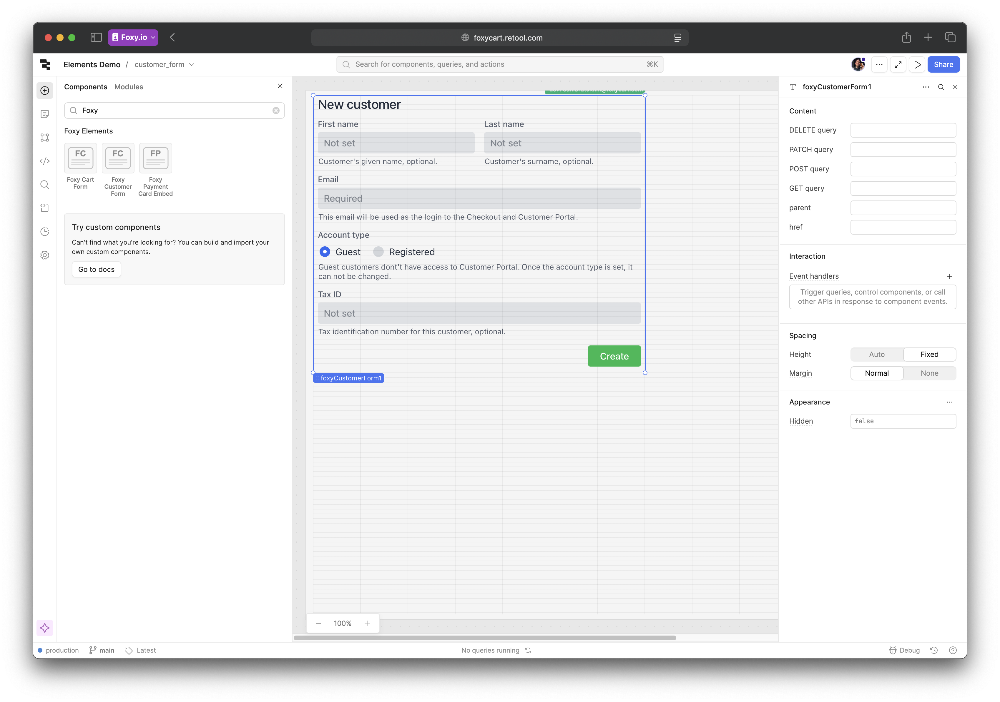
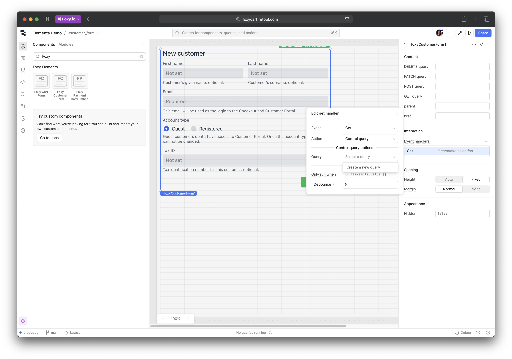
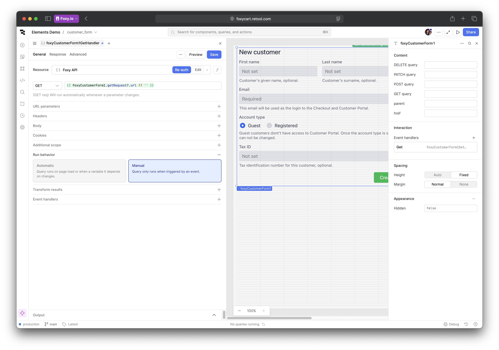
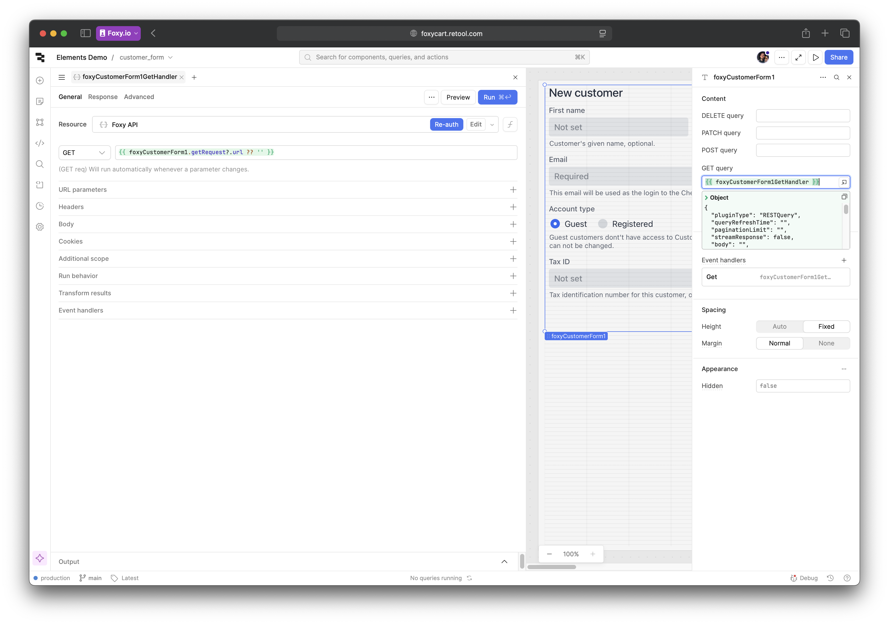
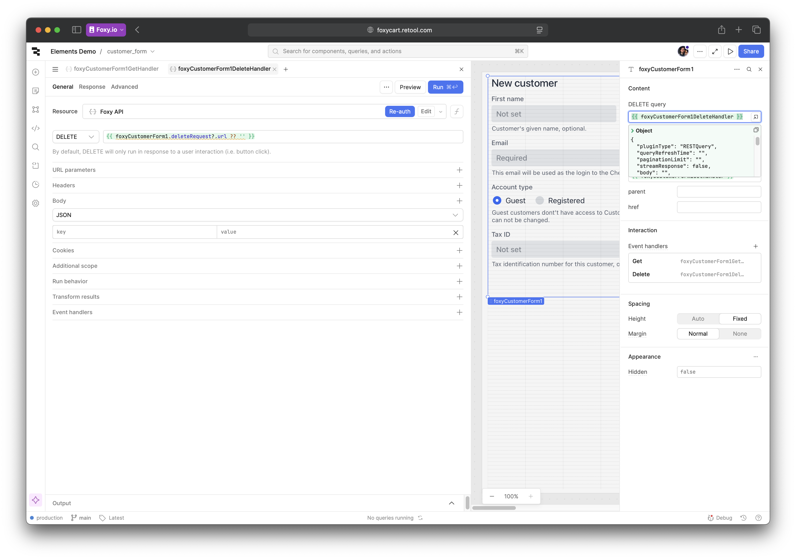
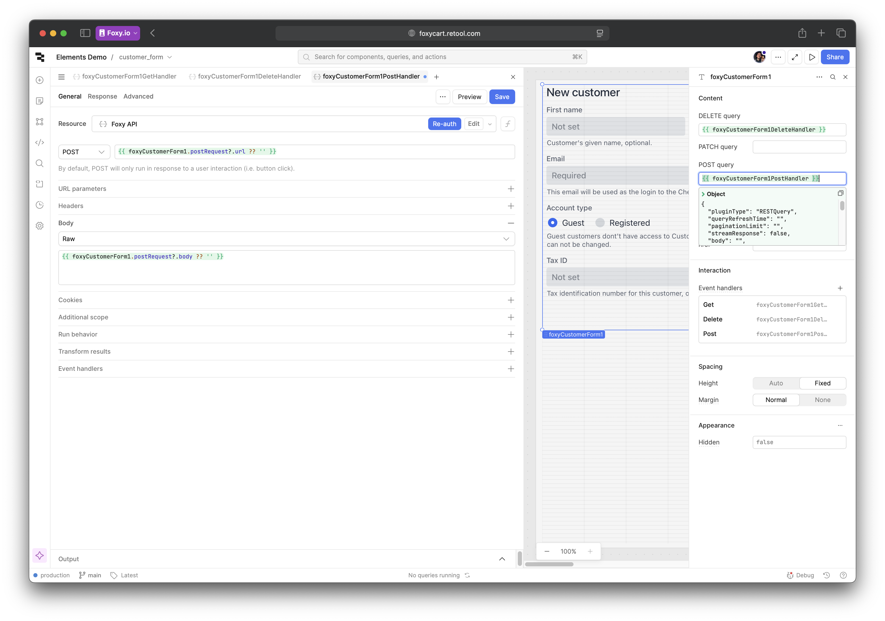
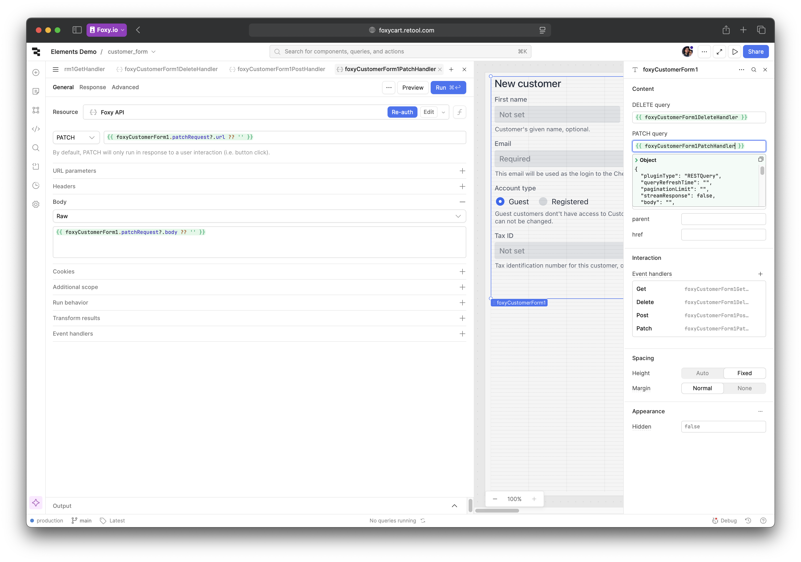
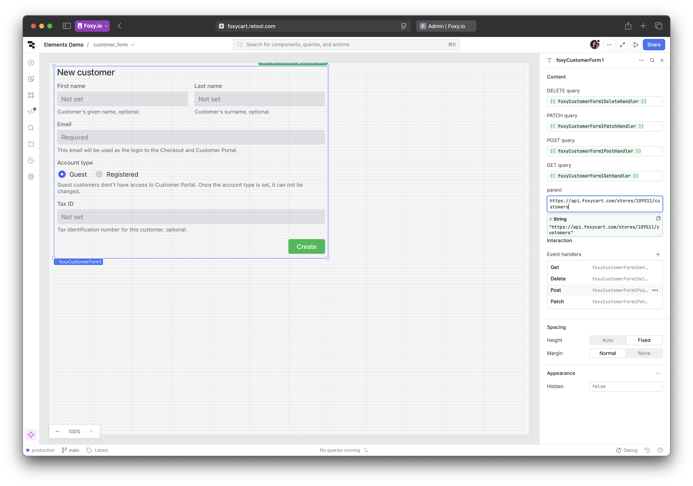
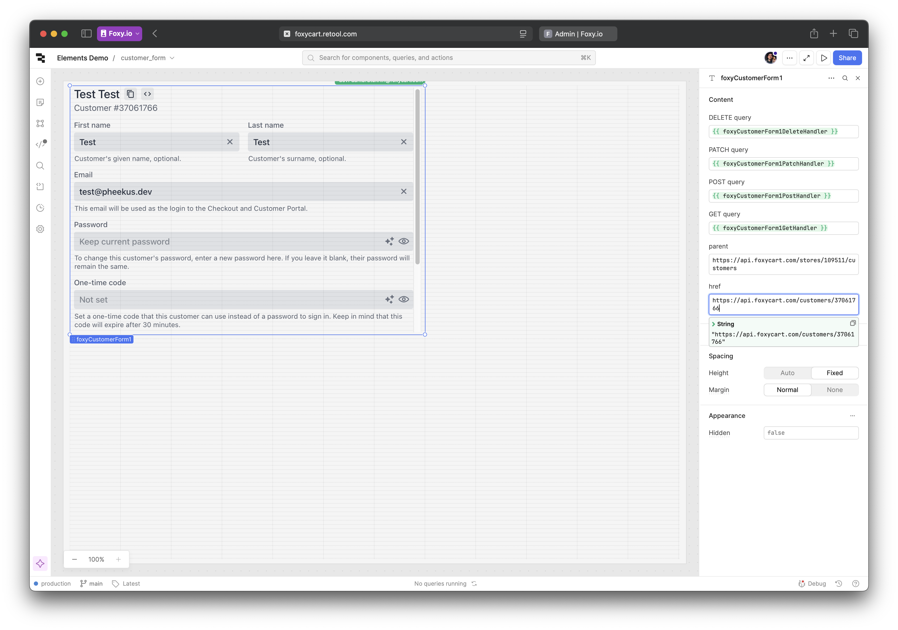

# Example: CustomerForm

This guide will walk you through the process of integrating the CustomerForm component into your Retool application. This guide works for any Element based on NucleonElement class. You can recognize them by `href` and `parent` properties/attributes in the code or in the docs on elements.foxy.io. Examples of such Elements include `CustomerForm`, `AddressForm`, `Transaction`, and others.

## Relevant code

1. [FoxyCustomerForm.tsx](./src/FoxyCustomerForm.tsx) - the main component file for the CustomerForm.
2. [index.tsx](./src/index.tsx) - the entry point for the custom component library, where the CustomerForm and the language file loader are registered.
3. [env.d.ts](./src/env.d.ts) - type definitions for the custom component library, including the CustomerForm component.
4. [useNucleonElement.ts](./src/hooks/useNucleonElement.ts) - a custom hook that simplifies working with Elements based on NucleonElement in Retool.
5. [useCustomAttribute.ts](./src/hooks/useCustomAttribute.ts) - a custom hook that simplifies setting custom attributes on Elements. Not used in this example but can be seen in [FoxyCartForm.tsx](./src/FoxyCartForm.tsx) where additional configuration is necessary to run the cart form.

## Adding the component to your project

Open Retool and navigate to your project. Look for Foxy Elements > Foxy Customer Form component in the components menu and drag it onto the canvas. You should see the empty state load right away:

## Linking the component to your store

To link this form to your store, you'll need to create a REST API query for each one of the following methods: `GET`, `POST`, `PATCH` and `DELETE`. Separate queries are needed because Retool does not support setting HTTP method dynamically. Luckily, the setup is straightforward because we already have a Foxy API resource set up in Retool. If you haven't done this yet, follow the instructions in the [Setting up Foxy API Resource in Retool](./setting-up-api-resource.md) guide.

Let's start with the `GET` query. In the Retool editor, select your Customer Form component and add an event handler for the Get event under Interaction settings. Select "Control query" for Action and "Create a new query" for Query.

In the query editor, select Foxy API resource, set the method to `GET`, and use the following value for the URL: `{{ foxyCustomerForm1.getRequest?.url ?? '' }}` (if you named your component differently, replace `foxyCustomerForm1` with the actual name of your component). This allows our custom component to update the query URL dynamically based on the request it's currently handling. In Run behaviour, select "Manual" to prevent the query from running automatically when the component is loaded.

Click "Save" to save the query and link it to the "GET query" property on the Customer Form component. This will give our component access to the query state and the data it returns. In this example, `foxyCustomerForm1GetHandler` is the name of the query we just created, so make sure to replace it with the actual name of your query if it's different:

Repeat the same steps for `DELETE` query, but this time set the method to `DELETE` and use the following value for the URL: `{{ foxyCustomerForm1.deleteRequest?.url ?? '' }}`. Link it to the "DELETE query" property on the Customer Form component.

Now let's add the `POST` and `PATCH` queries. These are slightly different because they require a body to be sent with the request. Start by adding an event listener for the Post event setting the method and URL as before (POST, `{{ foxyCustomerForm1.postRequest?.url ?? '' }}`). Then select Raw body as the Body type and use the following value for the body: `{{ foxyCustomerForm1.postRequest?.body ?? '' }}`. This will ensure that the body is set correctly based on the request being handled by the component. Finally, click Save and add the query to the "POST query" property on the Customer Form component:

Repeat the same steps for the `PATCH` query, setting the method to `PATCH`, URL to `{{ foxyCustomerForm1.patchRequest?.url ?? '' }}`, and body to `{{ foxyCustomerForm1.patchRequest?.body ?? '' }}`. Link it to the "PATCH query" property on the Customer Form component:

Your component is now ready to handle API requests. Let's point it to your store. In the Retool editor, select your Customer Form component and set the "parent" property to the `fx:customers` API endpoint of your store. It should look like this: `https://api.foxycart.com/stores/YOUR-STORE-ID/customers`. If you are unsure about your store ID, you can find it using the API Browser in Foxy Admin.

Parent URL if enough to enable creating new customers via CustomerForm. If you want to load an existing customer, you need to set the "href" property to the URL of the customer you want to load. This URL should look like this: `https://api.foxycart.com/customers/CUSTOMER-ID`. Replace `CUSTOMER-ID` with the ID of the customer you want to load. You will likely want to set this dynamically in the real application.

Done! Try making some changes in the form and clicking Save. You should see the customer data being updated in your store.

## Notes on URLs

- Being a Hypermedia API, Foxy API uses URLs to represent resources and their relationships. Because of this, the exact URL structure is important for the component to work correctly. The `parent` property must always point to the collection of resources (e.g., customers, addresses, transactions), while the `href` property must point to a specific resource within that collection.
- Some Elements, like `CartForm`, require `zoom` parameter in the parent and href URLs to work correctly. The exact value will depend on the Element. Please refer to the [documentation](https://elements.foxy.io) for the specific Element you are using.
- Some Elements will also require additional URLs in the configuration. For example, `CartForm` requires 9 extra attributes to enable the full functionality. You can check [FoxyCartForm.tsx](./src/FoxyCartForm.tsx) file to see how you can link these attributes to the Retool editor.
