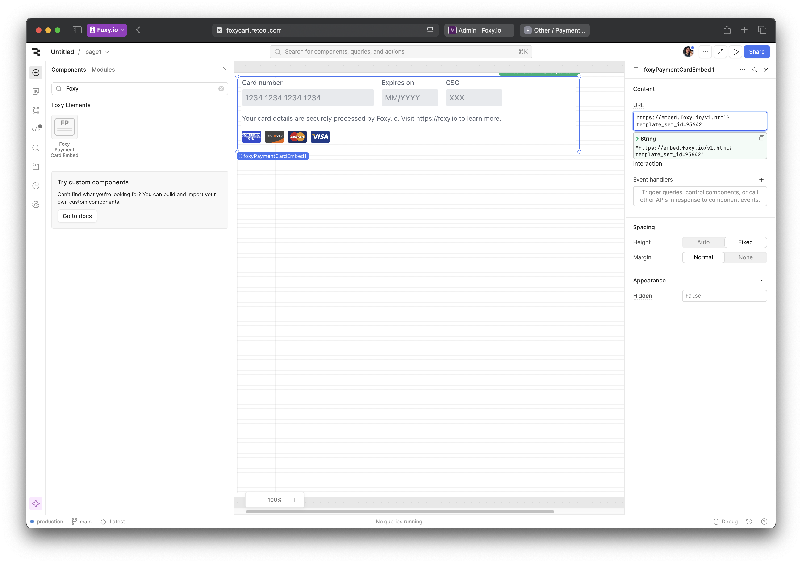
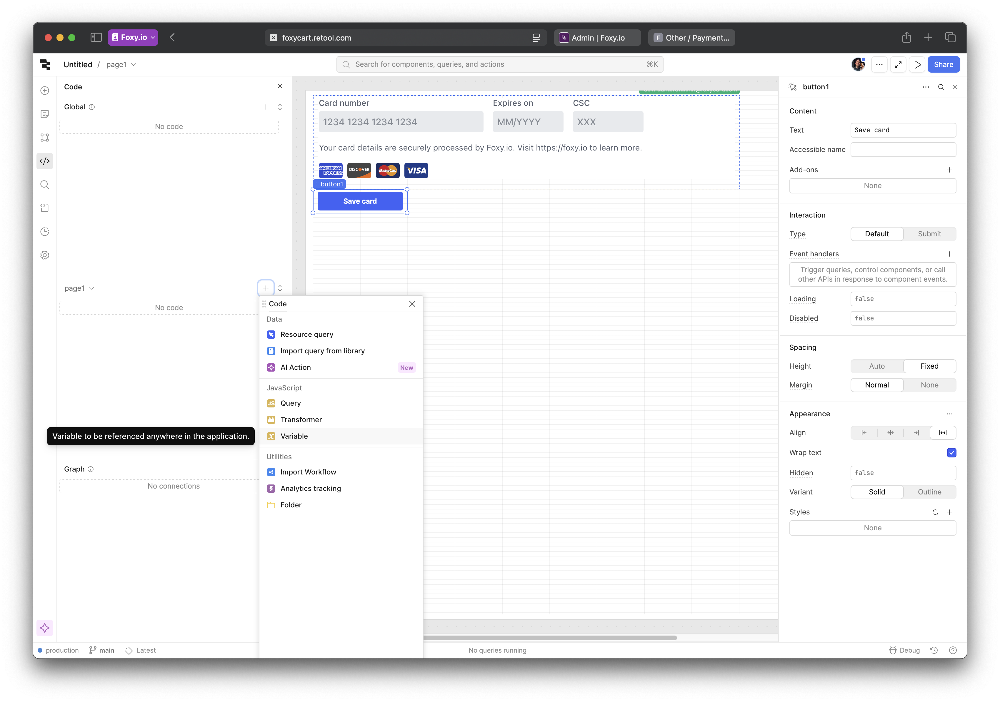
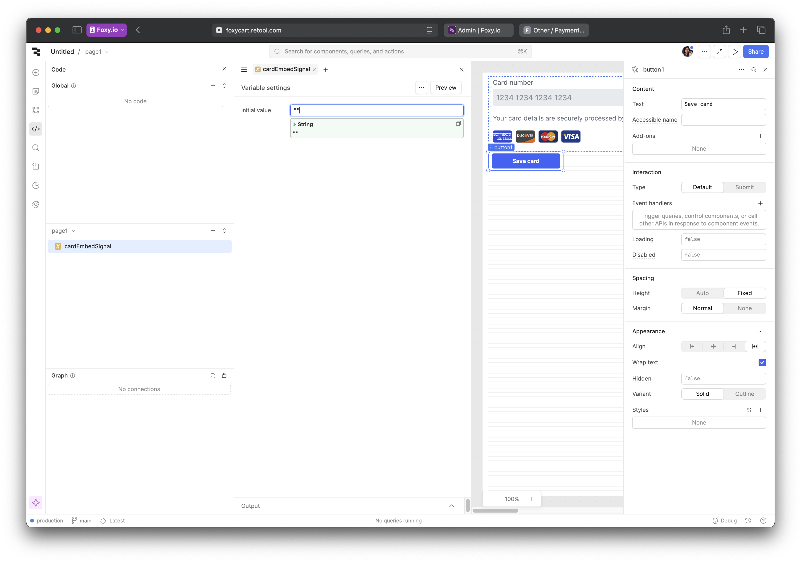
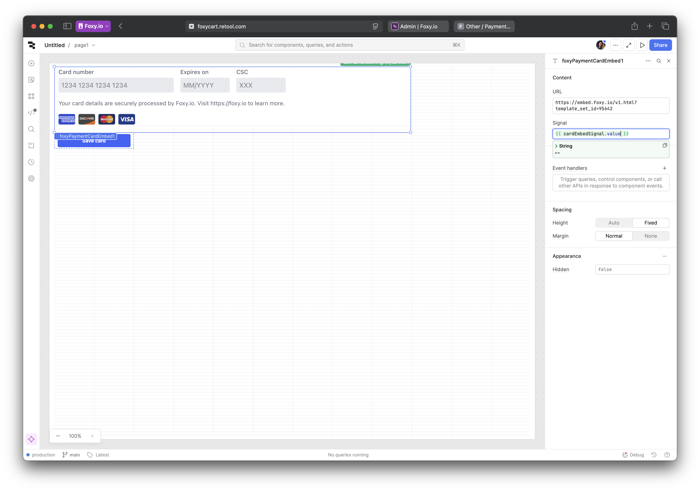
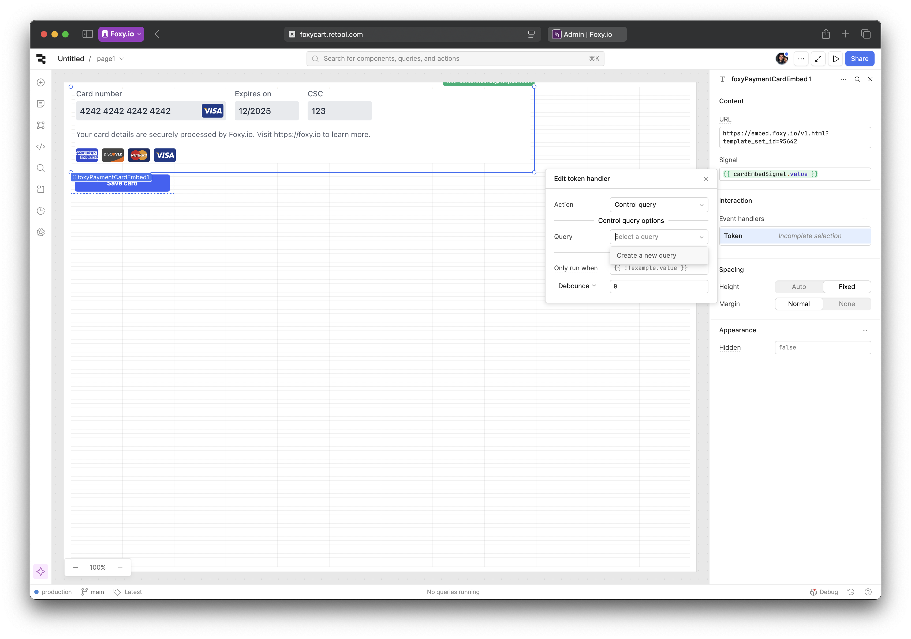
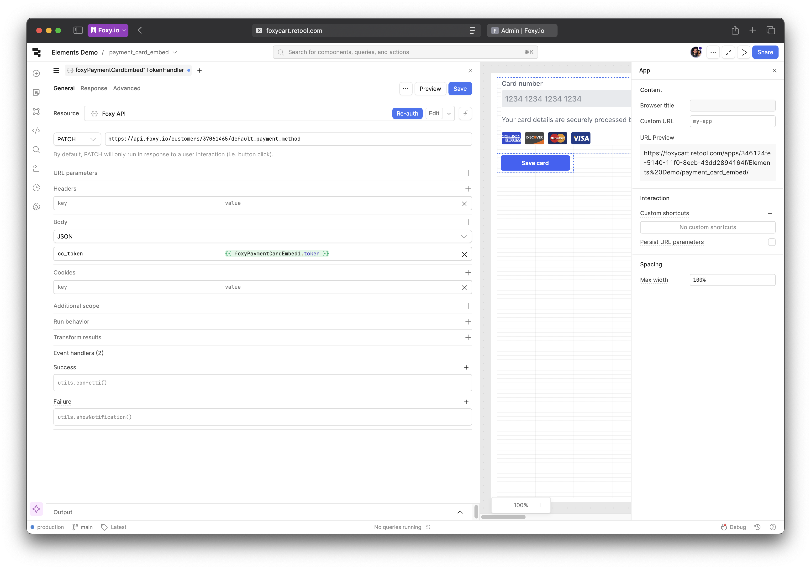

# Example: PaymentCardEmbed

This guide will walk you through the process of integrating the Foxy Payment Card Embed component into your Retool application. The Payment Card Embed allows you to securely collect payment card details and tokenize them for use in your application.

## Relevant code

1. [FoxyPaymentCardEmbed.tsx](./src/FoxyPaymentCardEmbed.tsx) - the main component file for the Payment Card Embed.
2. [index.tsx](./src/index.tsx) - the entry point for the custom component library, where the Payment Card Embed and the language file loader are registered.
3. [env.d.ts](./src/env.d.ts) - type definitions for the custom component library, including the Payment Card Embed component.

## Adding the Payment Card Embed

Open Retool and navigate to your project. Look for Foxy Elements > Payment Card Embed component in the components menu and drag it onto the canvas. You should see the demo state load right away:

[](./img/1.png)

To link the payment embed to your store, go to Foxy Admin > Settings > Templates, select the Template Set you'd like to use and find its id.

[](./img/2.png)

Back in the Retool editor, select the Payment Card Embed component and replace the URL with the following: `https://embed.foxy.io/v1.html?template_set_id=` + your template set ID.

[](./img/3.png)

The embed will now display the appropriate UI for the payment method set linked to the template set.

## Tokenizing cards

Add a button below the payment card embed. In this example we'll label it "Save card":

[](./img/4.png)

Because Retool's component API is limited, we'll need to use a variable to send a signal to the payment card embed. In Retool, select Code in the sidebar, and create a variable scoped to the page payment card embed is on:

[](./img/5.png)

Give this new variable an appropriate name and set the inital value to an empty string:

[](./img/6.png)

Next, link the Signal property in the payment card embed settings to the variable you just created. Remember to use `{{ yourVariable.value }}` syntax to link to the actual value it holds:

[](./img/7.png)

Finally, in the button settings, add an event handler for the "Click" event. Select "Set variable" for Action, and choose the variable you created earlier in the State field. Use "Set value" for method, and "tokenize" for value – this is the signal that will trigger the tokenization process in the payment card embed.

[](./img/8.png)

To provide a better user experience, you can also add loading states or success messages based on the status of the tokenization process. In this demo, payment card embed exposes the `status` property with values `idle`, `busy`, and `fail`. You can link these states to the button's loading state under Interaction settings like so:

[](./img/9.png)

Now, try entering test card details (for example, `4242 4242 4242 4242` + any future expiration date and CVC) and clicking the "Save card" button. If everything is set up correctly, you should see the button and payment card embed switch to the loading state momentarily and then revert back to the original state. At that point, the token is already available in the `token` property of the payment card embed. You can see it by selecting State from the left sidebar and then the payment card embed component. Additionally, the `token` event has been emitted by our custom component to signal that the token is ready. From here, we can use this token to update customer's default payment method.

## Using the token to update customer's default payment method

For this step, you will need to set up a REST API resource in Retool to connect to the Foxy API. If you haven't done this yet, follow the instructions in the [Setting up Foxy API Resource in Retool](./setting-up-api-resource.md) guide.

In the Retool editor, select your payment card embed and add an event handler for the `token` event under Interaction settings. Select "Control query" for Action and "Create a new query" for Query.

[](./img/13.png)

In the panel that opens on the left, select Foxy API resource that you've created earlier. To save the new card, we will be using the [default payment method](https://api.foxy.io/rels/default_payment_method) relation from Foxy API with `PATCH` as request method. The URL will look like this:

```
https://api.foxy.io/customers/YOUR-CUSTOMER-ID/default_payment_method
```

You can get the customer ID from the admin dashboard for testing purposes. Later on you will likely be setting this value dynamically via a variable in the local or global state but this is outside of the scope for this guide.

Next, in the JSON body, add a single key `cc_token` with the value from the `token` property of the payment method embed component. For the purposes of this demo, you can also add a simple Success and Failure event handlers – for example, Confetti and Show Notification just to get some visual feedback. Hint: `{{ self.data.data._embedded['fx:errors'][0].message }}` in notification description will display the first API error in case it occurs.

[](./img/14.png)

Click Save and try it out! If you got confetti, then everything is working as expected. Check the customer page in the admin – it should show the new payment method. If you got an error, please send it to Foxy's support team and we will help you troubleshoot the issue.
