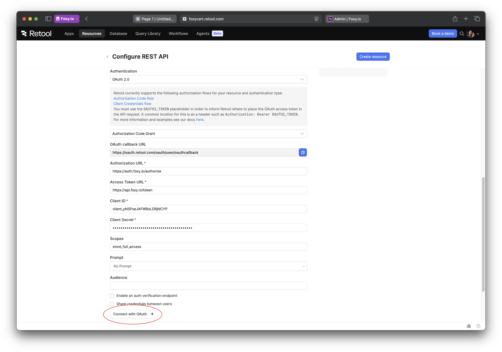

# Setting up Foxy API Resource in Retool

Foxy provides a comprehensive [API](https://api.foxy.io/docs) for managing every aspect of your store. This API uses Hypermedia format and OAuth2 for authentication. To get started, you will need a client. To obtain one, make the following request to `https://api.foxy.io/clients` with your project/contact info:

```sh
curl -H "FOXY-API-VERSION: 1" https://api.foxy.io/clients -d "redirect_uri=https://oauth.retool.com/oauth/user/oauthcallback&project_name=YOUR_PROJECT_NAME&company_name=YOUR_COMPANY_NAME&contact_name=YOUR_NAME&contact_email=YOUR_EMAIL&contact_phone=YOUR_PHONE"
```

In response you will receive Client ID, Client Secret and a set of tokens for managing your API client. Save those values as there's no way to recover them if they are lost.

Now let's create a new REST API Resource in Retool with those credentials. Click on the Retool logo in the top left corner, select Resources from the menu, and on the page that opens click on the "Create new" button and select "Resource". Then select REST API as a resource type.

In the form, enter the following details:

- **Name**: Foxy API (or any name you prefer)
- **Base URL**: empty (**IMPORTANT**: using base URL changes how Retool escapes dynamic values in the URL so it is important to leave this empty)
- **Headers**:
  1. Add a header with the key `Authorization` and the value `Bearer YOUR_ACCESS_TOKEN`
  2. Add a header with the key `FOXY-API-VERSION` and the value `1`
- **Authentication**: select "OAuth 2.0", with "Authorization Code Grant" flow
- **Authorization URL**: `https://auth.foxy.io/authorize`
- **Access Token URL**: `https://api.foxy.io/token`
- **Client ID**: Client ID you've obtained from the API earlier
- **Client Secret**: Client Secret you've obtained from the API earlier
- **Scopes**: `store_full_access`
- **Prompt**: select "No Prompt"

[](./img/10.png)

Once ready, click "Connect with OAuth" button.

[](./img/11.png)

If Retool asks to confirm connecting to the Foxy API, click "Authenticate" in the next screen. On the next page, pick the store you'd like to give Retool access to and click Allow.

[](./img/12.png)

Done! If everything went well, you should be redirected back to Retool and see "Connected" at the bottom of the page. You can now use this resource to make API calls to Foxy.
